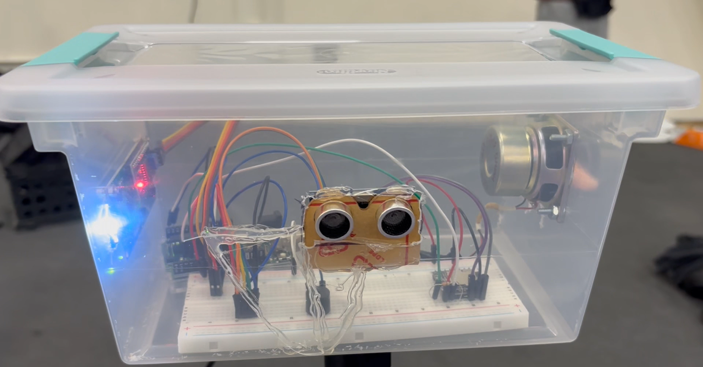
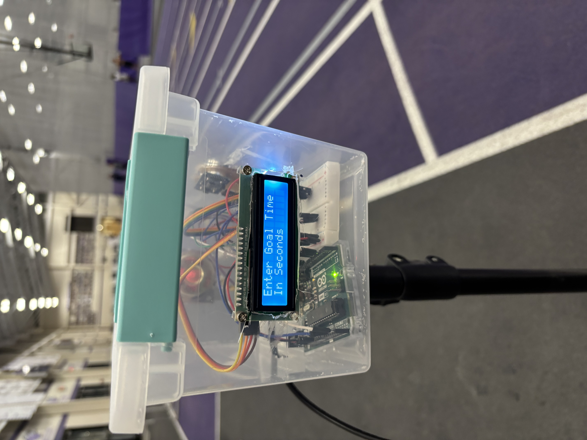
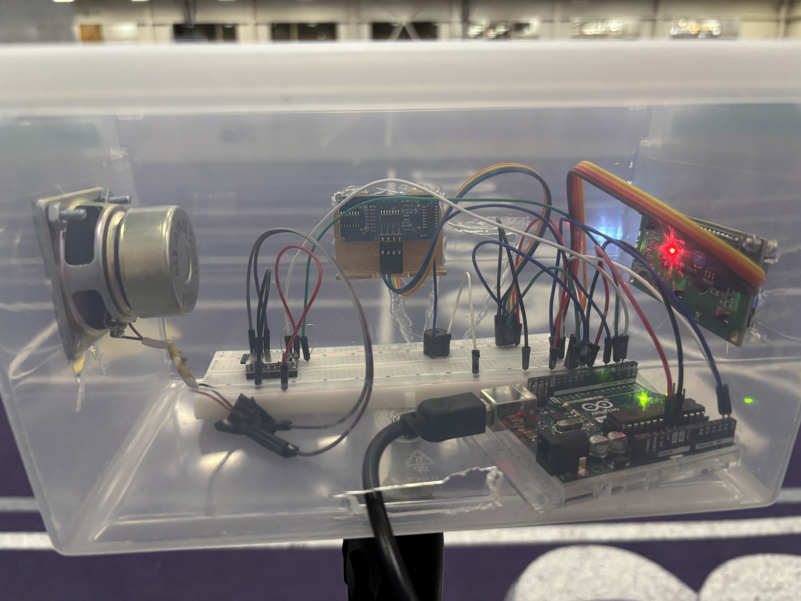
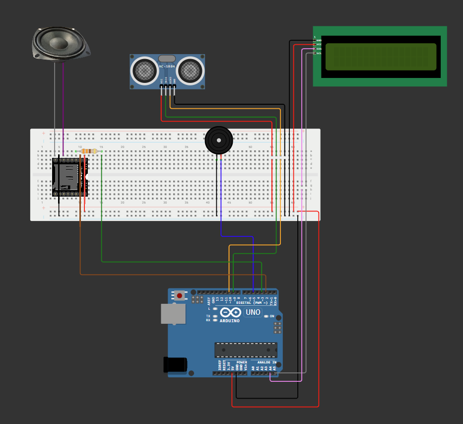

# TrackRabbit - Indoor Track Pacing Device  

*A real-time indoor track pacing device that detects runner passes, tracks lap times, and delivers audio feedback through a speaker.*

---

## 📝 Overview

This project is a physical device placed on a tripod at the start/finish line of a 200-meter indoor track.  
It detects each time a runner passes and provides real-time audio cues letting them know whether they are:

- Ahead of pace  
- Behind pace  
- Exactly on pace  

A 16×2 I2C LCD screen displays the current **elapsed time** and **lap count**.

Audio feedback covers ±10 seconds. Any difference beyond that triggers the phrases *“You are way ahead”* or *“You are way behind.”*

---

## ⭐ Features

### **Real-Time Detection**
- Ultrasonic sensor detects runner passes within 5–60 cm.
- Accurate even at full sprint speeds.

### **Audio Feedback**
- 23 MP3 files generated using BarkAI text-to-speech.
- Includes:
  - 10 "seconds ahead"
  - 10 "seconds behind"
  - On pace
  - Way ahead
  - Way behind
- Audio played through DFPlayer Mini + speaker.

### **Visual Feedback**
- LCD displays current lap count and elapsed time.

### **User Configuration**
- User enters goal lap time (in seconds) via serial input.
- Validation ensures the value is a positive integer.

---

## 🔧 Hardware Components

| Function           | Component                      |
|--------------------|---------------------------------|
| Microcontroller    | Arduino Uno R3                 |
| Proximity Sensor   | HC-SR04 Ultrasonic Sensor      |
| Audio Module       | DFPlayer Mini                  |
| Speaker            | 6-ohm computer speaker         |
| Tone Indicator     | Piezo buzzer                   |
| Display            | 16×2 I2C LCD Display Module    |

---

## 📸 Photos

### **Device – Front View**

### **LCD / Side View**

### **Internal Electronics**

### **Mounted on Tripod at Track**

---

## 🔌 Circuit Diagram

---

## ⚙️ How It Works

### **1. Initialization**
- Program prompts user for goal lap time (in seconds).
- Validates input.
- Timer begins on the runner’s first pass.

### **2. Motion Detection**
- Ultrasonic sensor sends pulses every 50 milliseconds.
- Pass counted only if runner is within 5–60 cm.
- Helps prevent false triggers.

### **3. Lap Tracking**
Each pass triggers:
- Piezo beep  
- Lap counter increment  
- Elapsed time update  
- Pace difference calculation  

### **4. Audio Logic**
- Determines whether the runner is ahead, behind, or on pace.
- Chooses correct MP3 file from micro SD card.
- Plays through DFPlayer Mini + external speaker.

